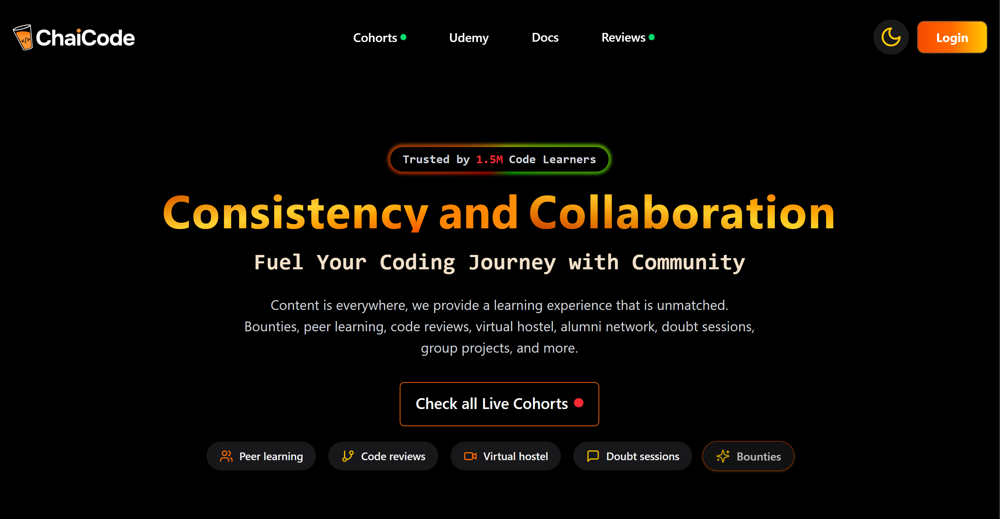

## 🧋 ChaiCode - Landing Page Redesign 🚀

A fully redesigned, animated, and responsive developer landing page for ChaiCode, built using React, Tailwind CSS, and Framer Motion.

It highlights cohorts, testimonials, videos, and core offerings in a sleek, modern UI.

### 🧋 Hero Section


## 🛠 Tech Stack

<p align="left">
  <a href="https://reactjs.org" style="padding-right: 10px;">
    
  </a>
  <a href="https://vitejs.dev" style="padding-right: 10px;">
    
  </a>
  <a href="https://tailwindcss.com" style="padding-right: 10px;">
    
  </a>
  <a href="https://www.framer.com/motion/" style="padding-right: 10px;">
    
  </a>
</p>


### 📁 Folder Structure

```
CHAI-CODE-REDESIGN/
├── .git/                  # Git metadata
├── node_modules/          # Installed dependencies
├── public/                # Static public assets
├── src/                   # Source code
│   ├── assets/            # Images, icons, media
│   ├── components/        # Reusable UI components
│   │   ├── Global/        # Global shared components (Navbar, Footer, etc.)
│   │   └── Home/          # Homepage-specific sections
│   ├── data/              # JSON files for topics, logos, testimonials
│   ├── pages/             # Page-level components (e.g., Home.jsx)
│   ├── App.jsx            # App root component
│   ├── index.css          # Global Tailwind styles
│   └── main.jsx           # React DOM rendering entry
├── .gitattributes
├── .gitignore
├── eslint.config.js       # Linting config
├── index.html             # HTML entry template
├── LICENSE
├── package-lock.json
├── package.json           # Project metadata and scripts
├── README.md
└── vite.config.js         # Vite build config
```


* ⚡ Lightning-fast build with Vite

* 🌓 Full Light/Dark Mode support with animated toggle

* 🧠 Topic Cloud with hover-only animation for performance

* 📽️ Integrated video reel via ReactPlayer

* 💬 Testimonials with swipe support on mobile

* 🪄 Rich, modern animations using Framer Motion

* 📱 Fully responsive & mobile-friendly

* ♻️ Clean & modular component architecture

### 🚀 Getting Started

## 📦 Installation & Local Setup

Follow these steps to run the project locally on your machine:

---

### 1️⃣ Clone the Repository

```bash
git clone https://github.com/your-username/CHAI-CODE-REDESIGN.git
cd CHAI-CODE-REDESIGN
```

---

### 2️⃣ Install Dependencies

Make sure you have **Node.js (v18 or above)** installed. Then run:

```bash
npm install
```

> This will install all required packages listed in `package.json`

---

### 3️⃣ Start the Development Server

```bash
npm run dev
```

> The project will start in development mode at:
> [http://localhost:5173](http://localhost:5173)

---

### 4️⃣ Build for Production (Optional)

To generate an optimized production build:

```bash
npm run build
```

> This will output static files into the `/dist` folder

---

### 5️⃣ Preview Production Build (Optional)

To preview the production build locally:

```bash
npm run preview
```

---

### 🛠 Troubleshooting

- If you face issues with port conflict, kill existing dev servers:
  ```bash
  lsof -i :5173
  kill -9 <PID>
  ```
- Make sure you’re using the right Node version (v18+ recommended)
- Delete `node_modules` and reinstall if things break:
  ```bash
  rm -rf node_modules
  npm install
  ```

---

✅ You’re all set! Happy hacking 🧠


npm run dev
### 🔒 Deployment

ChaiCode is Vercel-ready. Just push to GitHub and connect the repo to Vercel for instant deployment.

### 🧠 Author

Built by Santwan Pathak with chai in hand and framer-motion magic ✨
